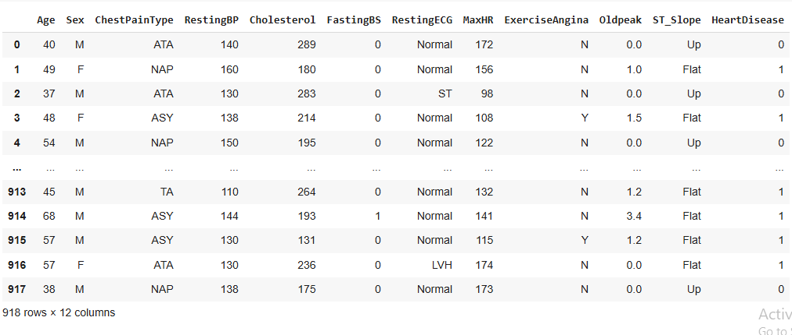
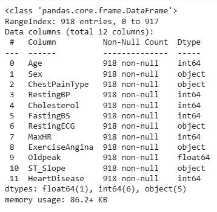
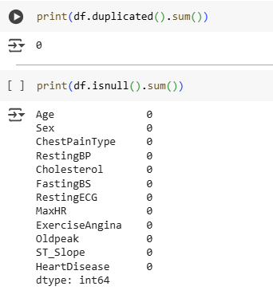
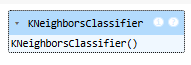
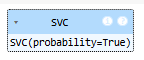
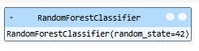
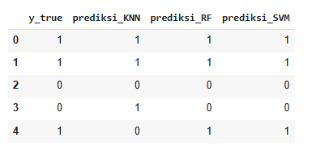

# Laporan Proyek Predictive Analytics

## Domain Proyek: Kesehatan


Penyakit jantung merupakan salah satu penyebab utama kematian di dunia. Faktor-faktor seperti tekanan darah tinggi, kadar kolesterol, riwayat medis, gaya hidup tidak sehat, dan usia dapat meningkatkan risiko seseorang terkena penyakit jantung. Dalam upaya meningkatkan deteksi dini dan pencegahan, analisis prediktif berbasis machine learning menawarkan potensi besar untuk mengidentifikasi individu yang berisiko tinggi berdasarkan data kesehatan mereka.

Melalui proyek ini, diharapkan dapat dibangun model klasifikasi yang akurat untuk memprediksi kemungkinan seseorang mengidap penyakit jantung. Model ini akan memanfaatkan data historis pasien yang mencakup berbagai parameter kesehatan. Selain itu, proyek ini juga akan memberikan wawasan tentang fitur-fitur mana yang paling berkontribusi terhadap risiko penyakit jantung.

# Business Understanding

## Problem Statements

Berdasarkan latar belakang di atas, rumusan masalah dari proyek ini adalah:

1. Dari berbagai fitur yang tersedia, fitur mana yang paling berpengaruh terhadap kemungkinan seseorang mengidap penyakit jantung?
2. Bagaimana cara memprediksi kemungkinan seseorang terkena penyakit jantung berdasarkan riwayat fitur-fitur kesehatan yang tersedia?

## Goals

Tujuan dari proyek ini adalah:

* Mengidentifikasi fitur-fitur yang paling berkorelasi dengan risiko penyakit jantung.
* Membangun model klasifikasi machine learning yang akurat untuk memprediksi risiko penyakit jantung berdasarkan fitur kesehatan.

## Solution Statements

Untuk mencapai tujuan di atas, solusi yang diusulkan adalah:

* Melakukan analisis eksplorasi data (EDA) guna memahami karakteristik data dan hubungan antar fitur dengan label (HeartDisease).
* Menerapkan dan membandingkan beberapa algoritma klasifikasi (SVM, Random Forest, dan KNN) untuk menentukan model terbaik.

## Metodologi

Karena target variabel (HeartDisease) bersifat biner, pendekatan yang digunakan adalah klasifikasi. Model klasifikasi akan memprediksi kelas target (1 = mengidap penyakit jantung, 0 = tidak mengidap) berdasarkan input fitur.

Langkah-langkah utama metodologi adalah:

1. **Preprocessing Data:** Pembersihan data, penanganan data kategorikal, normalisasi, dan pemisahan data.
2. **Exploratory Data Analysis (EDA):** Analisis deskriptif, visualisasi distribusi, dan korelasi antar fitur.
3. **Modeling:** Pelatihan dan evaluasi berbagai model klasifikasi.
4. **Model Evaluation:** Evaluasi model menggunakan metrik yang sesuai.
5. **Interpretasi:** Analisis hasil dan interpretasi fitur penting.

## Metrik Evaluasi

Metrik evaluasi yang digunakan dalam proyek ini mencakup:

* **Accuracy:** Proporsi prediksi yang benar terhadap total prediksi.
* **Precision:** Proporsi prediksi positif yang benar-benar positif.
* **Recall (Sensitivity):** Proporsi kasus positif yang berhasil dikenali.
* **F1-Score:** Rata-rata harmonis antara precision dan recall.

# Data Understanding

## Deskripsi Dataset

Dataset ini digunakan untuk memprediksi apakah seseorang berisiko mengidap penyakit jantung berdasarkan parameter kesehatan.



## Atribut Data



Berikut adalah daftar atribut beserta deskripsinya:

| Fitur          | Deskripsi                                        |
| -------------- | ------------------------------------------------ |
| Age            | Usia pasien (tahun)                              |
| Sex            | Jenis kelamin (M: Male, F: Female)               |
| ChestPainType  | Jenis nyeri dada (TA, ATA, NAP, ASY)             |
| RestingBP      | Tekanan darah saat istirahat (mm Hg)             |
| Cholesterol    | Kadar kolesterol (mg/dl)                         |
| FastingBS      | Gula darah puasa (> 120 mg/dl: 1, else: 0)       |
| RestingECG     | Hasil elektrokardiogram saat istirahat           |
| MaxHR          | Detak jantung maksimum yang dicapai              |
| ExerciseAngina | Angina yang dipicu oleh olahraga (Y/N)           |
| Oldpeak        | Depresi ST yang diinduksi oleh olahraga          |
| ST\_Slope      | Kemiringan segmen ST (Up, Flat, Down)            |
| HeartDisease   | Target: 1 = memiliki penyakit jantung, 0 = tidak |

## Sumber Dataset

* Kaggle: [https://www.kaggle.com/fedesoriano/heart-failure-prediction](https://www.kaggle.com/fedesoriano/heart-failure-prediction)

## Ukuran Dataset

* Jumlah observasi: 918
* Jumlah fitur: 11 (tidak termasuk target)
* Target: HeartDisease (biner)

Dataset ini sangat cocok untuk proyek klasifikasi karena memiliki data yang relevan, ukuran yang cukup untuk eksperimen, serta konteks medis yang penting.

## Missing Value & Outlier
Mengecek missing value, duplikat, dan data yang dianggap memiliki kejanggalan.



**Data Duplikat**
Jumlah data duplikat: 0
Tidak ada data duplikat yang perlu dihapus dari dataset.

**Missing Value**
Tidak terdapat missing value pada seluruh kolom dalam dataset.

**Outlier**
Melakukan visualisasi data dengan boxplot untuk tiap fitur numerik guna mengidentifikasi outlier. Boxplot menunjukkan bahwa terdapat outlier pada kolom:

* Age
* RestingBP
* Cholesterol
* MaxHR
* Oldpeak


Outlier ditangani menggunakan metode IQR (Interquartile Range), dilakukan dalam tiga iterasi hingga data bersih dari outlier. Setelah proses ini, dataset menyisakan 691 baris dan 12 kolom.


---

## Exploratory Data Analysis - Univariate Analysis
Univariate analysis bertujuan untuk memahami distribusi masing-masing fitur secara individual.

**Fitur Kategorikal**

* **Sex**: Mayoritas adalah laki-laki (>70%).
  
  

* **ChestPainType**: Tipe nyeri dada paling umum adalah ASY, diikuti oleh NAP, ATA, dan TA.
  

* **FastingBS**: Sekitar 80% partisipan memiliki kadar gula darah puasa normal (nilai 0).
  
  

* **RestingECG**: Sebagian besar hasil EKG normal, namun \~40% menunjukkan abnormalitas (LVH/ST).

  

* **ExerciseAngina**: Sekitar 62.8% tidak mengalami angina saat olahraga.

  

* **ST\_Slope**: Hampir 50% pasien memiliki slope Up, diikuti Flat (47%) dan Down (4.6%).

  


**Fitur Numerik**


* **Age**: Distribusi hampir normal, dominan usia 50–60 tahun.
* **RestingBP**: Terdapat lonjakan pada nilai umum (120, 130, 140) yang mungkin default input.
* **Cholesterol**: Distribusi skewed ke kanan, mayoritas antara 200–250 mg/dL.
* **MaxHR**: Distribusi normal antara 130–170 bpm.
* **Oldpeak**: Skewed ke kanan, banyak nol, nilai tinggi terindikasi outlier.

---

## Exploratory Data Analysis - Multivariate Analysis
Bertujuan untuk memahami hubungan antar fitur.

**Fitur Kategorikal vs HeartDisease**


* **Sex**: Laki-laki memiliki proporsi lebih tinggi mengalami penyakit jantung.
* **ChestPainType**: Tipe ASY paling berhubungan dengan penyakit jantung; ATA paling rendah.
* **RestingECG**: Tipe ST dan LVH lebih dominan pada pasien dengan penyakit jantung.
* **ExerciseAngina**: Pasien dengan angina saat olahraga menunjukkan prevalensi tinggi penyakit jantung.
* **ST\_Slope**: Slope datar dan menurun berkorelasi kuat dengan HeartDisease.

**Fitur Numerik vs HeartDisease**


* Distribusi fitur numerik diamati menggunakan pairplot untuk membandingkan pasien dengan dan tanpa penyakit jantung.
* **Oldpeak** dan **MaxHR** menunjukkan perbedaan pola yang signifikan antar kelompok target.

**Matriks Korelasi**


* Korelasi antara fitur numerik dengan penyakit jantung (HeartDisease) menunjukkan:

  * **Oldpeak** memiliki korelasi positif tertinggi terhadap HeartDisease (**0.50**) yang berarrti semakin tinggi nilai Oldpeak, semakin besar kemungkinan terkena penyakit jantung.
  * **MaxHR** memiliki korelasi negatif tertinggi terhadap HeartDisease (**-0.39**) yaitu semakin rendah detak jantung maksimal, semakin besar kemungkinan terkena penyakit jantung.
  * **Age** dan **RestingBP** memiliki korelasi positif lemah terhadap HeartDisease (**0.31** dan **0.17**).
  * **Cholesterol** menunjukkan korelasi yang sangat lemah terhadap HeartDisease (**0.091**), hampir tidak ada pengaruh.
  * **Age** dan **MaxHR** berkorelasi negatif (**-0.4**), semakin tua usia, semakin rendah detak jantung maksimal.
  * **Age** dan **Oldpeak** berkorelasi positif (**0.29**), usia lebih tua cenderung memiliki nilai Oldpeak lebih tinggi.
  * Korelasi antara fitur lainnya relatif lemah atau mendekati nol, menunjukkan hubungan yang tidak signifikan secara linear.

---

**Kesimpulan EDA**

* Tidak ditemukan data duplikat maupun missing values.
* Outlier berhasil dihapus, menyisakan 691 baris data yang bersih.
* Fitur kategorikal seperti ChestPainType, ExerciseAngina, dan ST\_Slope menunjukkan korelasi kuat terhadap HeartDisease.
* Fitur numerik Oldpeak dan MaxHR memperlihatkan pola berbeda antar label target.
* Dataset siap digunakan untuk tahap feature engineering dan pemodelan prediktif.

---

# Data Preparation  

## Encoding Fitur Kategorik

Untuk mengubah fitur kategorikal menjadi bentuk numerik yang dapat diproses oleh algoritma machine learning, digunakan `LabelEncoder` dari scikit-learn. Fitur yang dikodekan antara lain: `Sex`, `ChestPainType`, `RestingECG`, `ExerciseAngina`, dan `ST_Slope`.


```python
from sklearn.preprocessing import LabelEncoder

cat_cols = ['Sex', 'ChestPainType', 'RestingECG', 'ExerciseAngina', 'ST_Slope']
df_encoded = df.copy()
for col in cat_cols:
    le = LabelEncoder()
    df_encoded[col] = le.fit_transform(df_encoded[col])
```

## Splitting Data

Data dibagi menjadi 80% untuk pelatihan dan 20% untuk pengujian menggunakan `train_test_split`.

```python
from sklearn.model_selection import train_test_split

X = df_encoded.drop("HeartDisease", axis=1)
y = df_encoded["HeartDisease"]

X_train, X_test, y_train, y_test = train_test_split(X, y, test_size=0.2, random_state=42)
```

## Feature Scaling Numerik

Fitur numerik diskalakan menggunakan `StandardScaler` untuk membuat distribusinya standar (mean = 0, std = 1).

```python
from sklearn.preprocessing import StandardScaler

num_cols = ['Age', 'RestingBP', 'Cholesterol', 'MaxHR', 'Oldpeak']
scaler = StandardScaler()

X_train[num_cols] = scaler.fit_transform(X_train[num_cols])
X_test[num_cols] = scaler.transform(X_test[num_cols])
```

---

# Model Development

Tiga model machine learning digunakan dalam penelitian ini:

* K-Nearest Neighbors (KNN)
* Support Vector Machine (SVM)
* Random Forest

## 1. K-Nearest Neighbors (KNN)

```python
from sklearn.neighbors import KNeighborsClassifier

knn = KNeighborsClassifier(n_neighbors=5)
knn.fit(X_train, y_train)
```



**Parameter Penting:**

* `n_neighbors=5`: Melihat 5 tetangga terdekat untuk klasifikasi.

**Kelebihan:**

* Sederhana dan mudah dipahami.
* Tidak memerlukan pelatihan model.

**Kekurangan:**

* Lambat pada dataset besar.
* Sensitif terhadap fitur dengan skala berbeda.

## 2. Support Vector Machine (SVM)

```python
from sklearn.svm import SVC
svm = SVC(kernel='rbf', C=1.0, gamma='scale', probability=True)
svm.fit(X_train, y_train)
```



**Parameter Penting:**

* `kernel='rbf'`: Kernel Radial Basis Function.
* `C=1.0`: Parameter regularisasi.
* `gamma='scale'`: Penyesuaian otomatis pengaruh titik data.
* `probability=True`: Mengaktifkan prediksi probabilitas.

**Kelebihan:**

* Cocok untuk dataset kecil hingga menengah.
* Efektif untuk data dengan margin pemisah yang jelas.

**Kekurangan:**

* Kurang efisien pada dataset besar.
* Sulit untuk diinterpretasi.

## 3. Random Forest

```python
from sklearn.ensemble import RandomForestClassifier

rf = RandomForestClassifier(n_estimators=100, random_state=42, max_depth=None, criterion="gini")
rf.fit(X_train, y_train)
```



**Parameter Penting:**

* `n_estimators=100`: Jumlah pohon dalam hutan.
* `max_depth=None`: Pohon tumbuh bebas sampai semua daun murni.
* `criterion="gini"`: Menggunakan indeks Gini untuk split.

**Kelebihan:**

* Mampu menangani dataset besar dengan fitur banyak.
* Mengurangi risiko overfitting.

**Kekurangan:**

* Interpretasi model lebih kompleks.
* Membutuhkan waktu lebih lama dibanding model sederhana.

---

# Evaluasi Model

Evaluasi dilakukan menggunakan:

1. **Accuracy**: Proporsi prediksi yang benar terhadap seluruh data uji.
2. **Confusion Matrix**: Matriks 2x2 yang menampilkan TP, TN, FP, dan FN.
3. **Classification Report**:

   * **Precision**: Kemampuan model menghindari false positives.
   * **Recall**: Kemampuan model mendeteksi semua data positif (true positives).
   * **F1-score**: Harmonik rata-rata precision dan recall.

```python
from sklearn.metrics import accuracy_score, classification_report, confusion_matrix
```

## Hasil Evaluasi

#### KNN:

* **Accuracy**: 81.3%
* **Confusion Matrix**:
  \[\[67 11]
  \[15 46]]
* **F1-score (class 1)**: 0.78

#### SVM:

* **Accuracy**: 86.3%
* **Confusion Matrix**:
  \[\[67 11]
  \[ 8 53]]
* **F1-score (class 1)**: 0.85

#### Random Forest:

* **Accuracy**: 87.8%
* **Confusion Matrix**:
  \[\[69 9]
  \[8 53]]
* **F1-score (class 1)**: 0.86

## Kesimpulan Evaluasi

* **Random Forest** menunjukkan performa terbaik dengan akurasi 87.8%, precision, recall, dan f1-score tinggi di kedua kelas.
* **SVM** menyusul dengan akurasi 86.3%, performa seimbang.
* **KNN** paling rendah performanya dengan akurasi 81.3% dan recall yang lebih rendah pada kelas 1.

## Visualisasi Akurasi

```python
acc = pd.DataFrame(index=['KNN', 'Random Forest', 'SVM'], columns=['Train', 'Test'])
acc.loc['KNN'] = [accuracy_score(y_train, knn.predict(X_train)), accuracy_score(y_test, y_pred_knn)]
acc.loc['Random Forest'] = [accuracy_score(y_train, rf.predict(X_train)), accuracy_score(y_test, y_pred_rf)]
acc.loc['SVM'] = [accuracy_score(y_train, svm.predict(X_train)), accuracy_score(y_test, y_pred)]

fig, ax = plt.subplots()
acc.plot(kind='barh', ax=ax, zorder=3, color=['skyblue', 'orange'])
ax.set_title("Akurasi Model KNN, Random Forest, dan SVM")
ax.grid(zorder=0)
plt.tight_layout()
plt.show()
```


---

## Prediksi Sampel

```python
prediksi = X_test.iloc[:5].copy()
pred_dict = {
    'y_true': y_test.iloc[:5].values,
    'prediksi_KNN': knn.predict(prediksi),
    'prediksi_RF': rf.predict(prediksi),
    'prediksi_SVM': svm.predict(prediksi)
}

pd.DataFrame(pred_dict)
```



**Analisis Sampel**
* Sampel 1–3: Semua model prediksi benar.
* Sampel 4: Hanya KNN yang salah.
* Sampel 5: KNN salah, RF dan SVM benar.
* Dari 5 sampel, RF dan SVM lebih konsisten dibandingkan KNN.
* KNN dua kali gagal memprediksi dengan benar.
* Indikasi awal bahwa RF dan SVM lebih andal, meskipun perlu pengujian pada dataset lebih besar untuk validasi akhir.


## Kesimpulan Akhir:

* **Random Forest** menunjukkan performa terbaik (akurasi 87.8%).
* **SVM** menyusul dengan akurasi 86.3% dan hasil seimbang.
* **KNN** memiliki akurasi terendah dan paling banyak kesalahan pada prediksi sampel.

Random Forest dan SVM tampak lebih andal pada dataset ini dalam mendeteksi penyakit jantung.

